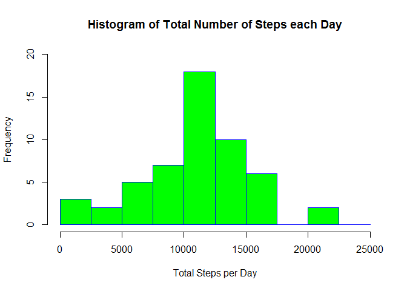
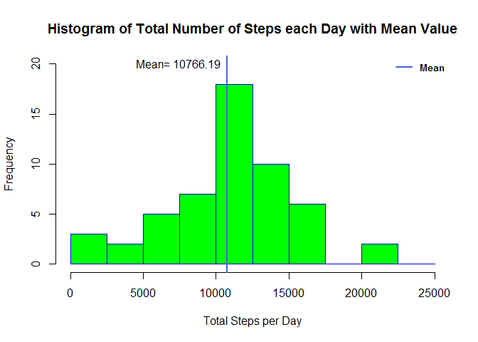
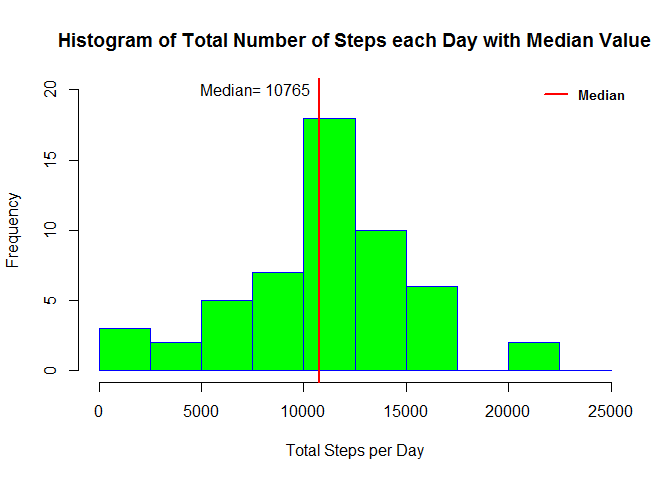
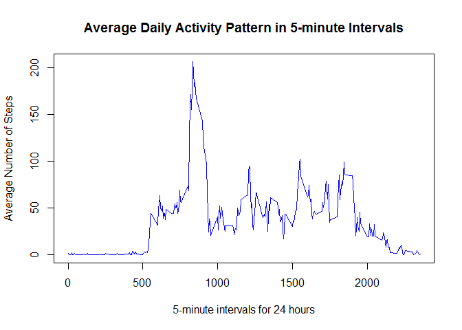
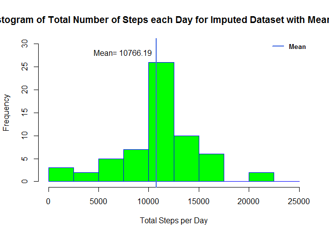
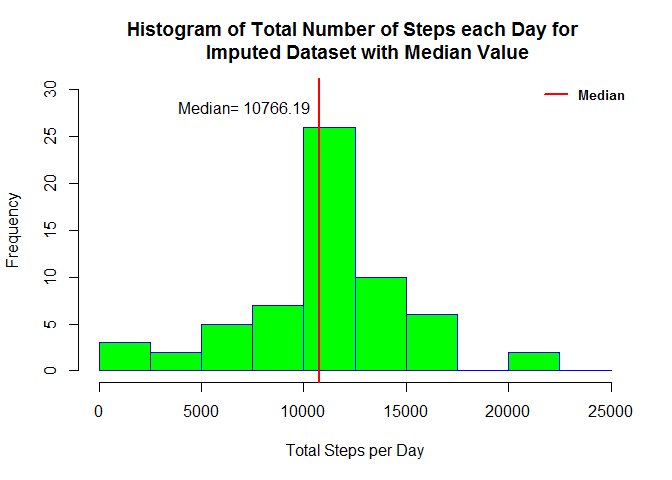
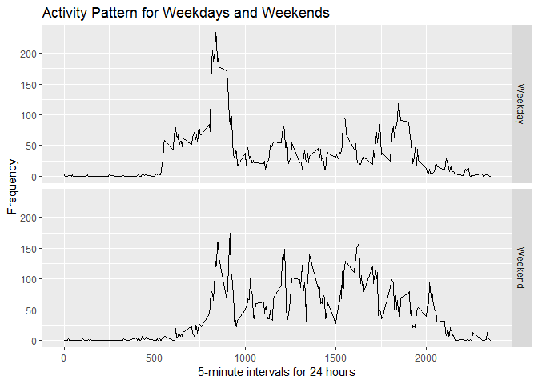

# Course Project 1 Assignment
The course project will be completed in a single R markdown document that can be processed by knitr and transformed into an HTML document. 
The original README file for the assignment and the data used for the analysis is in the repository. 

# Introduction
The data for the assignment is from a personal activity monitoring device. This device collects data at 5 minute intervals through out the day. The data consists of two months of data from an anonymous individual collected during the months of October and November, 2012 and include the number of steps taken in 5 minute intervals each day.

# Data
Data can be downloaded from the repository, and contains 17,568 observations. 

* Dataset: activity.csv (52K)  

> The variables in this dataset are: 

* __steps__:Number of steps taking in a 5-minute interval(missing values are coded as >NA) 
* __date__: the date on which the measurements were taken in YYYY-MM-DD format 
* __interval__: Identifier for the 5-minute interval in which measurements were taken  

# Load and preprocessing the data
Data is a csv file and will be read in using read.csv, and a summary of the data is run. 
Preprocessing is one step that changes the date variable to a DATE object.


```r
#load file
activity <- read.csv("activity.csv", header=T)
summary(activity)
```

```
##      steps                date          interval     
##  Min.   :  0.00   2012-10-01:  288   Min.   :   0.0  
##  1st Qu.:  0.00   2012-10-02:  288   1st Qu.: 588.8  
##  Median :  0.00   2012-10-03:  288   Median :1177.5  
##  Mean   : 37.38   2012-10-04:  288   Mean   :1177.5  
##  3rd Qu.: 12.00   2012-10-05:  288   3rd Qu.:1766.2  
##  Max.   :806.00   2012-10-06:  288   Max.   :2355.0  
##  NA's   :2304     (Other)   :15840
```

```r
#change date from factor to date
activity$date <- as.Date(activity$date, format= "%Y-%m-%d")
```

# What is the mean total number of steps taken per day?
For this part of the assignment, we can ignore the missing values in the dataset. 

1. Make a histogram of the total number of steps taken each day

```r
#aggregate total steps per day
daily_steps <- aggregate(steps~date, data = activity, sum, na.rm=TRUE)
#histogram of total steps each day
hist(daily_steps$steps, 
     main= "Histogram of Total Number of Steps each Day",
     border = "blue",
     col="green",
     breaks= seq(0,25000, by=2500),
     xlim = c(0, 25000),
     xlab = "Total Steps per Day", 
     ylim = c(0, 20))
```

<!-- -->


2. Calculate and report the *mean* and *median* total number of steps taken per day.


```r
#mean of total steps each day
mean_value <-mean(daily_steps$steps, na.rm = T)
#print mean results
print(paste("The mean total number of steps each day is", mean_value))
```

```
## [1] "The mean total number of steps each day is 10766.1886792453"
```

```r
#median of total steps each day
median_value <-median(daily_steps$steps, na.rm = T)
#print median results
print(paste("The median total number of steps each day is", median_value))
```

```
## [1] "The median total number of steps each day is 10765"
```

## Histograms of mean and median estimates 

```r
#histogram of total steps each day reporting mean value
hist(daily_steps$steps, 
     main= "Histogram of Total Number of Steps each Day with Mean Value",
     border = "blue",
     col="green",
     breaks= seq(0,25000, by=2500),
     xlim = c(0, 25000),
     xlab = "Total Steps per Day", 
     ylim = c(0, 20))
abline(v=mean(daily_steps$steps),
            col="royalblue",
            lwd=2)
text(x=mean(daily_steps$steps),
     y=20,
     labels = paste("Mean=", 
                    round(mean(daily_steps$steps), 2)),
     pos = 2)
legend(x="topright",
       "Mean",
       col= "royalblue",
       lwd = 2, 
       cex=0.8,
       text.font = 2,
       box.lty = 0)
```

<!-- -->

```r
#histogram showing median
hist(daily_steps$steps, 
     main= "Histogram of Total Number of Steps each Day with Median Value",
     border = "blue",
     col="green",
     breaks= seq(0,25000, by=2500),
     xlim = c(0, 25000),
     xlab = "Total Steps per Day",
     ylim= c(0, 20))
abline(v=median(daily_steps$steps),
            col="red",
            lwd=2)
text(x=median(daily_steps$steps),
     y=20,
     labels = paste("Median=", 
                    round(median(daily_steps$steps), 2)),
     pos = 2)
legend(x="topright",
       "Median",
       col= "red",
       lwd = 2, 
       cex=0.8,
       text.font = 2,
       box.lty = 0)
```

<!-- -->

# What is the average daily pattern?
1. Make a time series plot(i.e. type="l") of the 5-minute interval(x-axis) and the average number of steps taken, averaged across all days(y-axis.)


```r
##without padding/changing interval to a time
avg_steps <- tapply(activity$steps, activity$interval, mean, na.rm=TRUE)
#plot for 5 min interval average daily steps
plot(row.names(avg_steps), avg_steps, type="l", xlab="5-minute intervals for 24 hours",
     ylab= "Average Number of Steps", main="Average Daily Activity Pattern in 5-minute Intervals", col="blue")
```

<!-- -->

2. Which 5-minute interval, on average across all days in the dataset, contains the maximum number of steps?


```r
#find max steps (use aggregate to get the full row of data)
ts <-aggregate(steps ~ interval,activity, mean)
max_steps <-ts[which.max(ts$steps),]
print(max_steps)
```

```
##     interval    steps
## 104      835 206.1698
```
# Imputing missing values
Note that there are a number of days/intervals where there are missing values (coded as NA). The presence of missing days may introduce bias into some calculations or summaries of the data.
1. Calculate and report the total number of missing values in the dataset (i.e., the total number of rows with > NA's)


```r
#Calculate and report total number of missing values
missing_data<-sum(is.na(activity))
print(paste("The number of missing values is", missing_data))
```

```
## [1] "The number of missing values is 2304"
```
2. Devise a strategy for filling in all of the missing values in the dataset. The strategy does not need to be sophisticated. For example, you could use teh mean/median for that day, of the mean for that 5-minute interval.
## Strategy used for imputing missing values
I tried two methods: 
* daily mean 
* 5-minute interval mean

I decided to use the mean for the 5-minute interval, as I felt this was more accurate than taking a daily mean. The strategy entails aggregating the mean step values across all days for each 5-minute interval, then replace the NA's in the dataset with the step value for the 5 minute interval that matches.

3. Create a new dataset that is equal to the original dataset but with the missing data filled in.


```r
#find the mean value of steps for the 5-minute intervals
ts <-aggregate(steps ~ interval,activity, mean)
#replace NA's with mean of 5 min interval
activity$steps_imputed <- ifelse(is.na(activity$steps) == TRUE, ts$steps[ts$interval %in% activity$interval], activity$steps)
#split into a new dataset with no misisng values
library(dplyr)
```

```
## 
## Attaching package: 'dplyr'
```

```
## The following objects are masked from 'package:stats':
## 
##     filter, lag
```

```
## The following objects are masked from 'package:base':
## 
##     intersect, setdiff, setequal, union
```

```r
interval_imputed <-activity %>%
  select(date, interval, steps_imputed)
#check new dataset
summary(interval_imputed)
```

```
##       date               interval      steps_imputed   
##  Min.   :2012-10-01   Min.   :   0.0   Min.   :  0.00  
##  1st Qu.:2012-10-16   1st Qu.: 588.8   1st Qu.:  0.00  
##  Median :2012-10-31   Median :1177.5   Median :  0.00  
##  Mean   :2012-10-31   Mean   :1177.5   Mean   : 37.38  
##  3rd Qu.:2012-11-15   3rd Qu.:1766.2   3rd Qu.: 27.00  
##  Max.   :2012-11-30   Max.   :2355.0   Max.   :806.00
```
4. Make a histogram of the total number of steps taken each day and Calculate and report the mean and median total number of steps taken per day. Do these values differ from the estimates from the first part of the assignment? What is the impact of imputing missing data on the estimates of the total daily number of steps?
## Histogram with Mean of imputed dailly steps


```r
#mean on the dataset without missing values
#first total(sum) of steps for each day
new_daily_steps <- aggregate(steps_imputed~date, data = interval_imputed, sum)
#mean of interval imputed daily steps
new_mean<-mean(new_daily_steps$steps_imputed)
#mean histogram
hist(new_daily_steps$steps_imputed, 
     main= "Histogram of Total Number of Steps each Day for Imputed Dataset with Mean Value",
     border = "blue",
     col="green",
     breaks= seq(0,25000, by=2500),
     xlim = c(0, 25000),
     xlab = "Total Steps per Day",
     ylim = c(0,30))
abline(v=new_mean,
       col="royalblue",
       lwd=2)
text(x=mean(new_daily_steps$steps_imputed),
     y=28,
     labels = paste("Mean=", 
                    round(mean(new_daily_steps$steps_imputed), 2)),
     pos = 2)
legend(x="topright",
       "Mean",
       col= "royalblue",
       lwd = 2, 
       cex=0.8,
       text.font = 2,
       box.lty = 0)
```

<!-- -->

## Mean of imputed daily steps


```r
#print mean of imputed daily steps
print(paste("The mean of steps from the imputed dataset using mean of 5-min interval is", new_mean, "While the mean of the original dataset is", mean_value))
```

```
## [1] "The mean of steps from the imputed dataset using mean of 5-min interval is 10766.1886792453 While the mean of the original dataset is 10766.1886792453"
```

## Histogram with Median of imputed daily steps


```r
#median of interval imputed daily steps
new_median<-median(new_daily_steps$steps_imputed)
#median histogram
hist(new_daily_steps$steps_imputed, 
     main= "Histogram of Total Number of Steps each Day for 
     Imputed Dataset with Median Value",
     border = "blue",
     col="green",
     breaks= seq(0,25000, by=2500),
     xlim = c(0, 25000),
     xlab = "Total Steps per Day",
     ylim = c(0,30))
abline(v=median(new_daily_steps$steps_imputed),
       col="red",
       lwd=2)
text(x=median(new_daily_steps$steps_imputed),
     y=28,
     labels = paste("Median=", 
                    round(median(new_daily_steps$steps_imputed), 2)),
     pos = 2)
legend(x="topright",
       "Median",
       col= "red",
       lwd = 2, 
       cex=0.8,
       text.font = 2,
       box.lty = 0)
```

<!-- -->

## Median of imputed daily steps  


```r
#print median of imputed daily steps
print(paste("The median of steps from the imputed dataset is", new_median, "While the median of the original dataset is", median_value))
```

```
## [1] "The median of steps from the imputed dataset is 10766.1886792453 While the median of the original dataset is 10765"
```

## Do these values differ from the estimates from the original dataset?  


```r
#print difference in mean between original data set and imputed data set
print(paste("The difference between the two means is", new_mean-mean_value))
```

```
## [1] "The difference between the two means is 0"
```

```r
#print difference between imputed and original median
print(paste("The difference between the two median values is", new_median-median_value))
```

```
## [1] "The difference between the two median values is 1.1886792452824"
```
There is no difference in the mean estimate and their is a difference of 1.8 steps for the median value between the two datasets. 

## What is the impact of imputing missing data on the estimates of the total number of steps?

There was no significant impact on the estimates of total number of steps by imputing missing data, on the mean and median values. A comparison of the summary and str command on the aggregated daily steps for both datasets indicate that the imputed data set had 8 more dates than the original data set. While the days increased, the mean and median estimates did not change. There was a small shift between the datasets in the 1st quarter and 3rd quarter daily steps.  

```r
summary(new_daily_steps)
```

```
##       date            steps_imputed  
##  Min.   :2012-10-01   Min.   :   41  
##  1st Qu.:2012-10-16   1st Qu.: 9819  
##  Median :2012-10-31   Median :10766  
##  Mean   :2012-10-31   Mean   :10766  
##  3rd Qu.:2012-11-15   3rd Qu.:12811  
##  Max.   :2012-11-30   Max.   :21194
```

```r
summary(daily_steps)
```

```
##       date                steps      
##  Min.   :2012-10-02   Min.   :   41  
##  1st Qu.:2012-10-16   1st Qu.: 8841  
##  Median :2012-10-29   Median :10765  
##  Mean   :2012-10-30   Mean   :10766  
##  3rd Qu.:2012-11-16   3rd Qu.:13294  
##  Max.   :2012-11-29   Max.   :21194
```

# Are there differences in activity patterns between the weekdays and weekends?

1. Create a new factor variable in the dataset with two levels -- "weekday" and "weekend" indicating whether a given date is a weekday or weekend day.


```r
#change date to weekday value
activity$weekdays <- weekdays(activity$date, abbreviate = FALSE)
#change weekdays character class to factor variable
activity$weekdays <- factor(activity$weekdays)
#check levels
levels(activity$weekdays)
```

```
## [1] "Friday"    "Monday"    "Saturday"  "Sunday"    "Thursday"  "Tuesday"  
## [7] "Wednesday"
```

```r
#rename all levels in order shown above to weekend or weekday for new factor variable
levels(activity$weekdays)<- c("Weekday", "Weekday", "Weekend", "Weekend","Weekday","Weekday","Weekday")
#check levels to confirm they are changed to 2 levels
levels(activity$weekdays)
```

```
## [1] "Weekday" "Weekend"
```

2. Make a panel plot containing a time series plot (i.e. type = "l") of the 5-minute interval (x-axis) and the average number of steps taken, averaged across all weekday days or weekend days (y-axis). 

```r
#get average steps for weekdays and weekends in 5 min interval
steps_day_type <- aggregate(steps ~interval + weekdays, data=activity, mean)

#plot daily steps for weekend, weekday using ggplot
library(ggplot2)
ggplot( steps_day_type, aes(interval, steps)) + 
  geom_line() + 
  facet_grid(weekdays ~ .) +
  labs(title="Activity Pattern for Weekdays and Weekends")+
  xlab("5-minute intervals for 24 hours") + 
  ylab("Frequency")
```

<!-- -->
